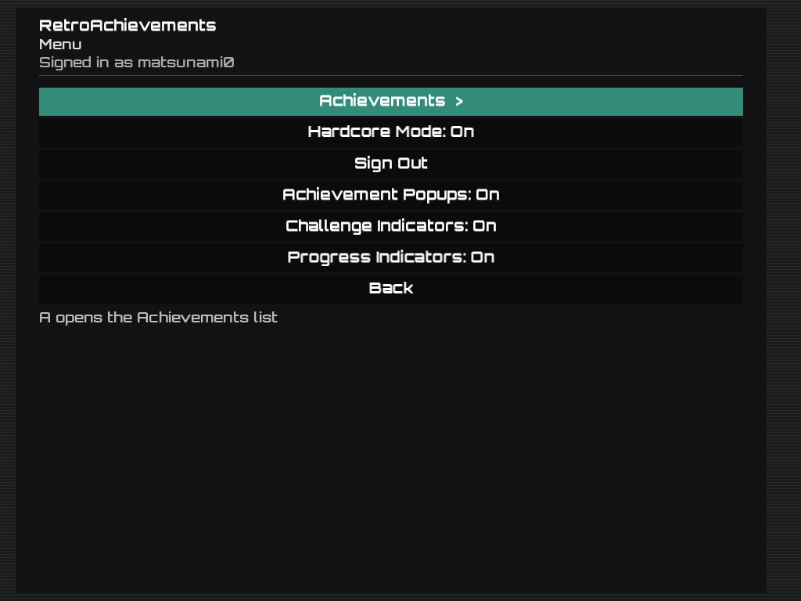
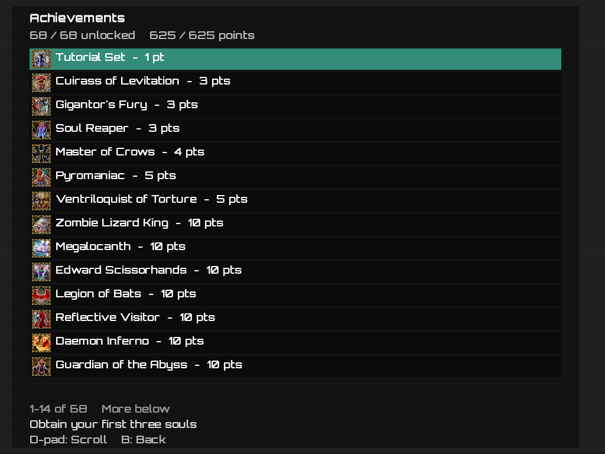
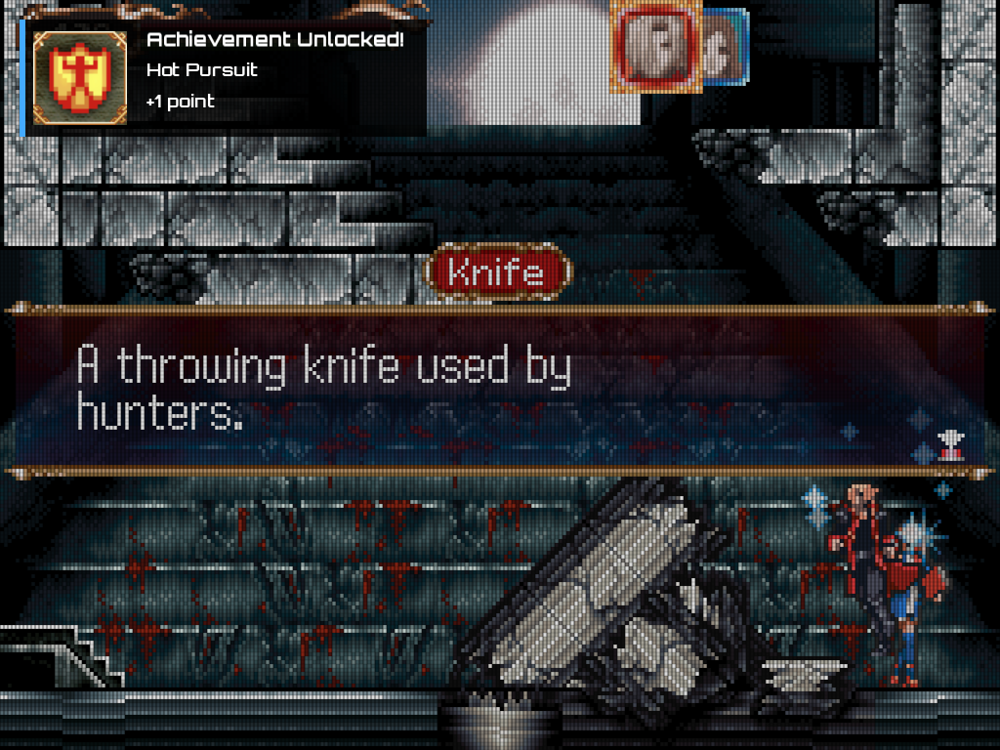

# RGDSPlus-RA

RetroAchievements integration for the stock Nintendo DS emulator included with the Anbernic RG DS Plus.

RGDSPlus-RA does **not** replace the Nintendo DS emulator. It is an `LD_PRELOAD` runtime integration layer around the existing NNDDSS / DraStic-based frontend.

## Status

RGDSPlus-RA includes both Casual and Hardcore modes.

Hardcore support is implemented and available, but RGDSPlus-RA is **not yet approved by RetroAchievements for Hardcore**.

v0.1.1 disables spectator mode and enables normal achievement submissions. Until RGDSPlus-RA is added to RetroAchievements' accepted emulator list, enabling Hardcore will produce the expected **Unknown Emulator** warning and achievements will be credited as Softcore.

## Screenshots

### RetroAchievements menu



### Achievement list



### Achievement unlock popup



## Features

- RetroAchievements login
- Nintendo DS game identification and hashing
- Achievement evaluation using rcheevos 12.5
- Achievement menu
- Badges and popup notifications
- Achievement unlock sound
- Rich Presence
- Challenge Indicators
- Progress Indicators
- Asynchronous RetroAchievements networking
- Persistent RetroAchievements settings

Hardcore implementation details and approval status are documented in `docs/HARDCORE_STATUS.md`.

## Hardcore protections

When Hardcore is enabled locally:

- all three known NNDDSS load-state execution paths are guarded
- load-state guards are installed before normal emulator startup resumes
- runtime cheat enabling is blocked
- cheats previously enabled in Casual are suppressed before DraStic builds its active cheat list
- save-state creation remains allowed
- fast-forward remains allowed

No rewind, slowdown, or frame-advance functionality was found in this frontend during development.

## Client identity

```text
RGDSPlus-RA/0.1.1 rcheevos/12.5
```

## Installation

1. Download `RGDSPlus-RA-v0.1.1.zip` from the [Releases](../../releases) page.

2. Extract the contents of the ZIP directly into the `Roms/APPS` folder on the SD card that contains your ROMs:

   ```text
   Roms/APPS
   ```

   After extracting, the folder should contain:

   ```text
   Roms/APPS/
   ├── RGDSPlus-RA-Install.sh
   ├── RGDSPlus-RA-Uninstall.sh
   └── RGDSPlus-RA/
       ├── libra_live.so
       ├── libra_popup.so
       └── libra_settings.so
   ```

3. Insert the SD card into the RG DS Plus and boot normally.

4. Open:

   **Applications → Apps**

5. Run:

   ```text
   RGDSPlus-RA-Install.sh
   ```

   The system will briefly display **Now Loading** and then return to the Applications menu.

6. Launch a Nintendo DS game normally.

7. Open the RetroAchievements menu.

   If you are not already signed in, select **Sign In** and enter your RetroAchievements username and password.

   Your login will be saved automatically for future launches and preserved if RGDSPlus-RA is uninstalled and reinstalled.

That's it.

## Uninstall

To remove RGDSPlus-RA:

1. Open **Applications → Apps**.
2. Run:

   ```text
   RGDSPlus-RA-Uninstall.sh
   ```

3. The stock Nintendo DS emulator will be restored automatically.

Your RetroAchievements login and RGDSPlus-RA settings are preserved so you can reinstall later without signing in again.

## Hardcore status

Hardcore Mode is implemented and its restrictions are enforced locally.

RGDSPlus-RA is not yet approved for official RetroAchievements Hardcore credit. Until approval, enabling Hardcore will produce the expected **Unknown Emulator** warning and achievements will be credited as Softcore.

## Compatibility

This release uses validated runtime offsets and currently supports only the exact emulator build listed in `SUPPORTED_BUILD.md`.

## What this repository does not contain

This project does not distribute NNDDSS, DraStic binaries, Anbernic firmware, Nintendo DS BIOS/firmware files, ROMs, or RetroAchievements credentials.

## Logs

`/tmp/ra_frontend.log`

## License

RGDSPlus-RA integration code is released under the MIT License. Third-party components retain their original licenses. See `THIRD_PARTY_NOTICES.md`.
